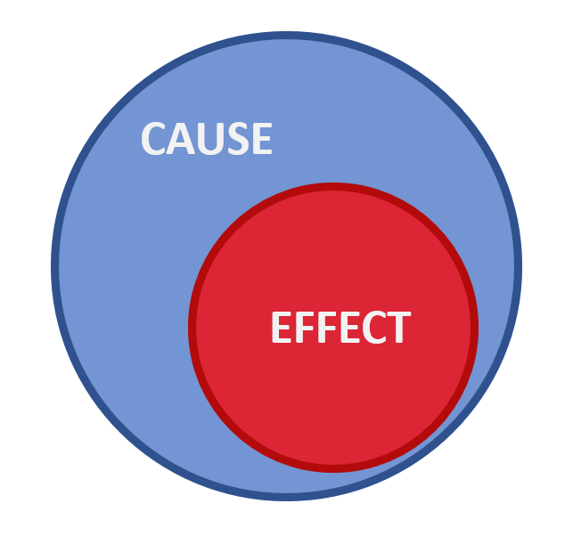
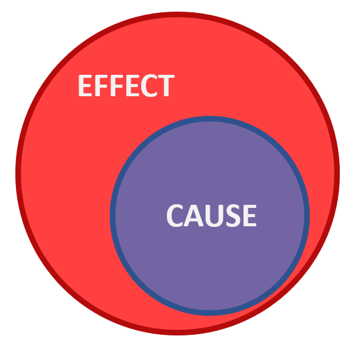
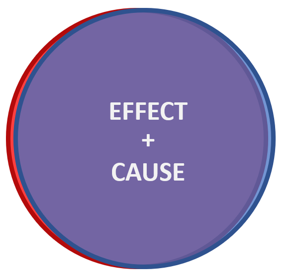
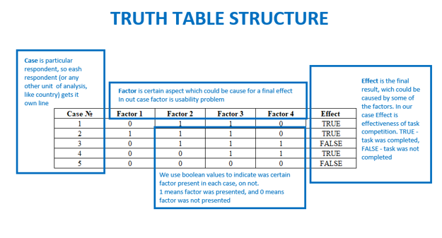
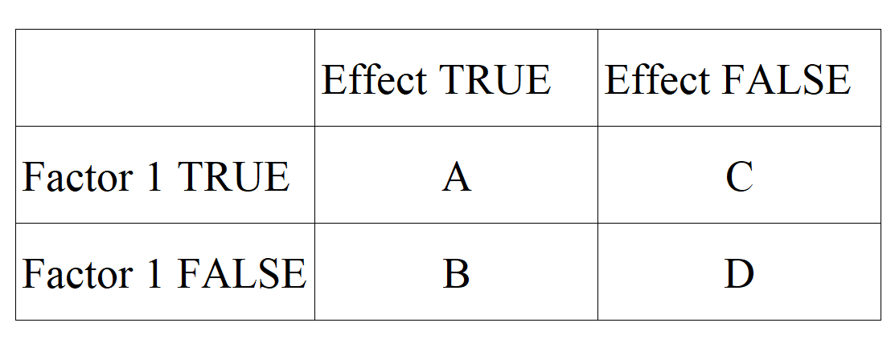
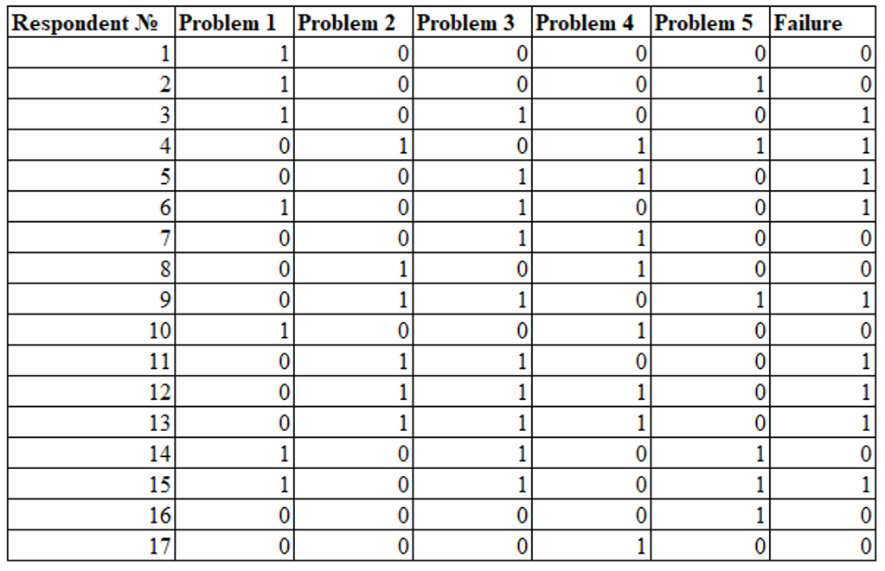
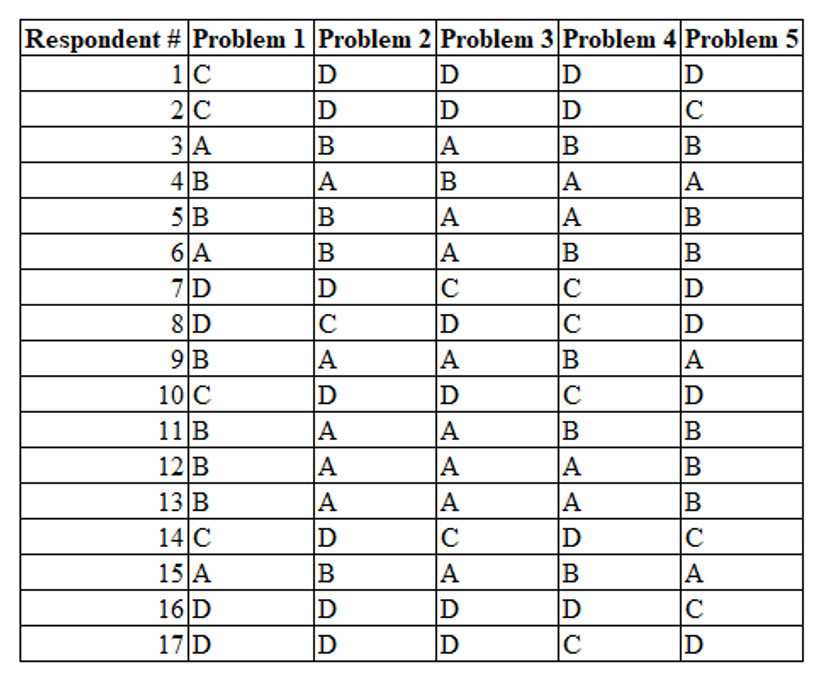
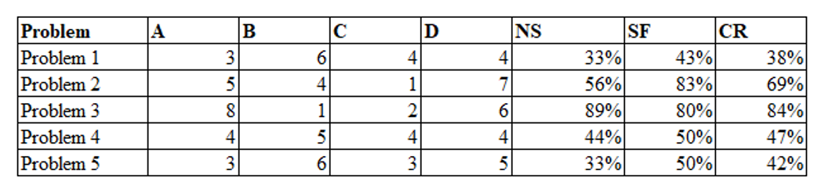

*It looks like another Goldberg machine. But, in reality, this technique could serve as an additional source of truth. You can’t have too many factors when you have to decide which usability problems correct foremost. And also, most of the techniques to prioritize usability problems are subjective, it’s good to add some more objectivity there.*

  ## What is QCA?

As a method, QCA was made to work in cases, where the general population is too small to use quantitative methods. For example, where you want to determine which factors lead to the economic prosperity of a state. There are nearly 200 states on our planet, so it’s hard to find enough cases for a quantitative study.
And here comes Qualitative Comparative Analysis on fancy Boolean algebra horse. This method helps us to estimate the causal strength of each factor. With this, we can say, **which usability problem is most crucial to fix**. 

*(This method matches better for remote unmoderated studies, where you can analyze more respondents. Not 5-10, but 10-20. And this is not a replacement for other methods to estimate critically for usability problems. It’s better to use them all).*

 ## Basic concepts of QCA

The base of this method is a deep understanding of cause-effect relations. In our case “Cause” is a usability problem and “Effect” is a success (or failure) of task completion. So, for every effect, there is a cause, and to describe the power of this relation we will use two measures — Necessity and Sufficiency.

 #### Necessity

Necessity is the measure that shows how necessary cause for an effect. 

 *In this picture we see the case of 100% necessity – there is no effect without this cause.*

 #### Sufficiency

Sufficiency shows us, at which extent causes enough to cause the effect.

 *In this picture we see 100% sufficiency – there is no cause without the effect.*

And so, 100% sufficiency and 100% necessity will give us 100% correlation:

 *It's not 100% in this pic, just for you to understand the mechanism.*

Playing with these two metrics we can make a synthetic index which we could use as a measure of the criticality of a usability problem:

CR =(NS+SF)/2

**So, with 100% sufficiency and 100% necessity, we will have 100% critically.**

To calculate these metrics we use truth tables (where each problem called "Factor", as a possible cause).

And for each factor we do separate tables:

Where:
 
 * A is the number of cases, where **factor and effect are both presents**

 * B is the number of cases, where **factor is absent and effect is present**

 * C is the number of cases, where **factor is present and effect is absent**

 * D is the number of cases where **factor and effect are both absent**

So, Necessity (Nc) measure will be:

 * NS = A(A+B)

And, Sufficiency (Sf)

 * SF = A/(A+C)

And, finally, our Criticality Index will be:

 * CI = (Nc+Sf)/2

 

Let’s watch these ideas on semi-real example! We have this one usability test protocol:

*Note, factors here are problems, and the effect is the failure (failed task)*

To test the Necessity and Sufficiency of each problem, we should count each A/B/C/D case:

And after this we could easily calculate all metrics using our formulas:

As we see, Problem 3 got the highest critical score, which means that correcting this problem will get us the highest benefit.

 ## Conclusion

And with this, we got on our hands another criticality evaluation method, which could help us to improve our backlog prioritization. We just barely touched the surface of QCA, so this field is untilled. And I would be really glad if anyone wants to dig deeper, there are tons of methodological treasures looking for their discoverer!
