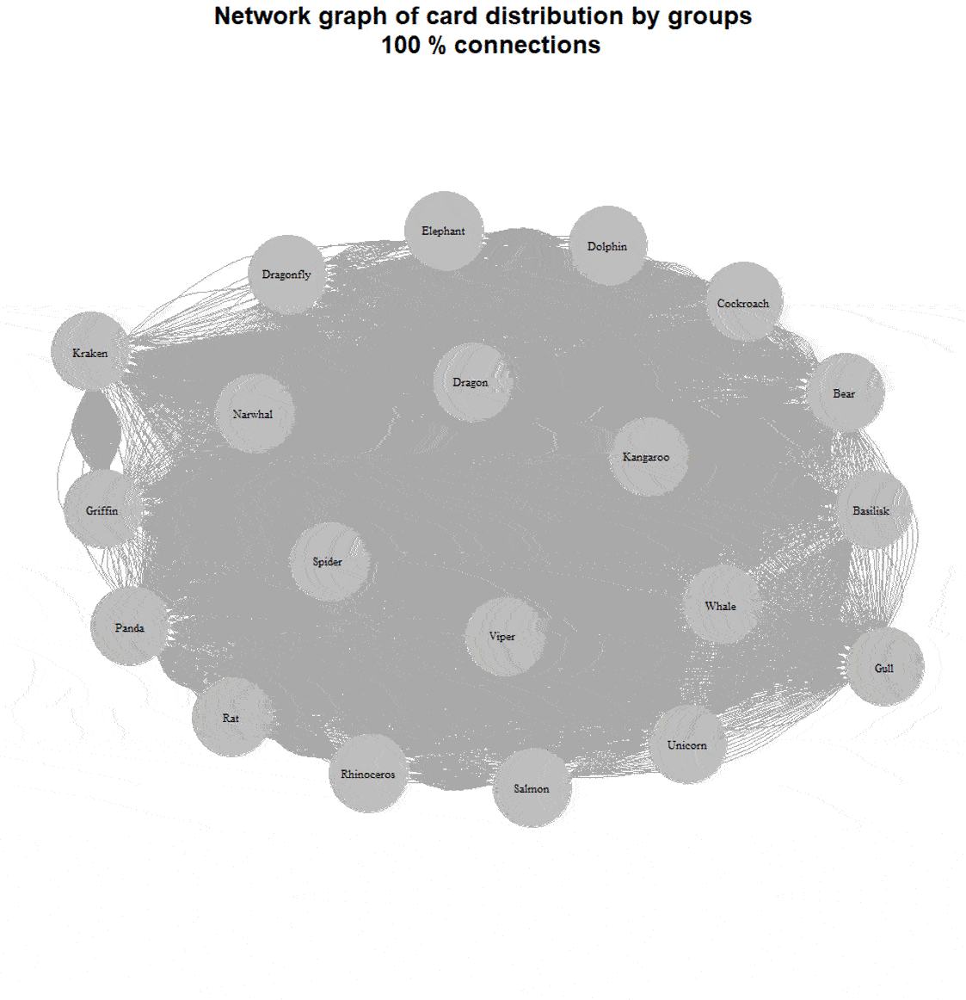

Card sorting is an excellent method for organizing the information architecture of a website or application. It's easy to collect data, but processing it can be challenging. Manually handling the dataset is quite tedious.

If you used an online service to collect the data, you might try their built-in processing tools, but they don't always yield clear results. We can spend hours staring at a correlation table without understanding what to do with it. Dendrograms are better, but not all platforms allow you to build them, and they often look confusing.

Today, I’d like to share a simple and straightforward way to process card sorting results so that you don't get lost and can present them clearly to your clients.

## A Bit About Card Sorting

Card sorting is a qualitative-quantitative method to find the most optimal grouping of entities. You can use it to build user-friendly app navigation or categorize products into understandable groups.

Participants are given cards to divide into groups in any logical way they prefer.

If you have predefined groups, it's called closed sorting. If participants can create as many groups as they want and name them, it's called open card sorting.



It's good practice to discuss with participants why they grouped cards the way they did. In-person research works better for this than remote.

There's also reverse card sorting, or tree testing, which can test an already structured system.

In this case, we'll talk about open card sorting.

## About the Data We'll Use

When I thought about this article, I couldn't find open test datasets for card sorting. Generating data myself wasn’t appealing, so I decided to collect my own [dataset](https://github.com/UXRozum/cardsort-en), available to everyone.



The task was to group 20 different animals. I deliberately designed the cards to avoid obvious grouping options:



I received 107 responses. Thanks to everyone who participated! I cleaned the collected data and ended up with this table:



Almost all variables were created automatically; I added a "Group_tag" column to tag groups based on my classification criteria.

The distribution was as follows:



Mixed grouping refers to cases where no clear basis for grouping could be identified. Biological grouping follows basic biology lessons (e.g., reptiles, birds, mammals), with fictional animals often placed in a separate category.

## Analyzing Results

To process the results, we need the RStudio program. It's free and can be downloaded [here](https://posit.co/download/rstudio-desktop/). RStudio works on both Windows and Mac.



Download the ready-to-use script [here](https://github.com/UXRozum/cardsort-en) and open it. I’ve detailed each step.

## Preparing for Work

First, install and load the necessary libraries:


#Step 0: Install libraries (run only once after installing R)
install.packages(c('openxlsx','igraph', 
  'factoextra', "ggwordcloud", 'rstudioapi'))

# Step 1: Load libraries
library(igraph)
library(openxlsx)
library(factoextra)
library(ggwordcloud)
library(rstudioapi)


To run the code, highlight it and press ctrl+enter.

After installation, you'll see this message:



When loading packages with the `library` command, you’ll get warnings — no need to worry about them:



Now we’re ready to work with the data.

## Loading Data into RStudio

First, load the `Card.xlsx` file from [here](https://github.com/UXRozum/cardsort-en). Place it in a separate folder (preferably with a Latin-based name).

To upload the data from `Card.xlsx`, use the following commands:


#Step 2: Select a folder
setwd(
  rstudioapi::selectDirectory()) 
#This should be a separate folder on your computer
#with a Latin name
#The folder should contain a data file - Card.xlsx

#Step 2.5: Load data
Raw <- read.xlsx('Card.xlsx') #The file must have at least three columns
#Card - card names
#Group_id - group ID (unique for EACH group)
#Group_name - group names provided by respondents


RStudio will prompt you to select the folder containing `Card.xlsx`. Analysis results will also be saved in this folder.



## Creating a Adjacency Table

A adjacency table shows how often each pair of cards appeared in the same group. Use the following commands to create and save it:


#Step 3: Create an adjacency table
Adj <- crossprod(table(Raw$Group_id, Raw$Card))
diag(Adj) = 0

#Step 4: Save the adjacency table
write.xlsx(as.data.frame(Adj), 'Adjacency.xlsx',
           overwrite = T, col.names = T, row.names=T)


The resulting file is called `Adjacency.xlsx`. Let’s take a look inside:



For instance, the cards "Viper" and "Basilisk" were grouped together 9 times out of 107. Let’s tidy up the table and add conditional formatting in Excel:



Now it’s clearer. For example, we can see that the Basilisk often appears with the Dragon (92 times) and the Kraken (91 times).

But it’s still unclear how to group and interpret these results.

## Clustering (Dendrogram)

Run the next step in the script:


#Edge betweenness algorithm - 
#https://en.wikipedia.org/wiki/Girvan%E2%80%93Newman_algorithm
Net <-  graph_from_adjacency_matrix(Adj, mode='undirected')
#Build network structure based on the adjacency table
Clust <- as.dendrogram(cluster_edge_betweenness(Net)) #Build clusters
fviz_dend(Clust, k=6 #Number of groups to obtain
          ,horiz=T) #Display the plot


The result is the following graph:



Let’s break it down. The edge-betweenness algorithm removes the least-connected cards sequentially, allowing stable groups to emerge. The dendrogram shows how to best divide the cards into a set number of groups. Here we used 6, but the number can vary from 1 to 20 (since we have 20 cards).



We can now draw conclusions about optimal groupings, but the dendrogram is still not very intuitive, especially for those unfamiliar with them.

## Building a Network Graph (Visual Analysis of Results)

While dendrograms are common in card sorting analysis, network graphs are rare.

A great article about analyzing card-sorting data using graph visualization is [Analyzing Card-Sorting Data Using Graph VisualizationJUS (uxpajournal.org)](https://uxpajournal.org/analyzing-card-sorting-data-using-graph-visualization/). However, this type of visualization is seldom used elsewhere.

A network graph visualizes connections between entities, where each entity is a node and each connection is an edge.



Let’s build a similar graph for our cards, where nodes represent cards and edges represent their grouping.


#Step 6: Build a network graph
plot.new()
plot.igraph(
  graph_from_adjacency_matrix(ifelse(Adj-10 < 0, 0, Adj-10)
                              #This is the number of connections to filter out, 
                              #the higher the number, the stronger the connections
                              #if the graph looks cluttered, increase this number
                              #focus on the number of respondents
                              
                              , mode='undirected'), 
  vertex.label.color= "black", vertex.color= "gray", 
  vertex.size= 20, vertex.frame.color='gray',asp = 0.7,
  layout = layout.kamada.kawai,
  vertex.label.cex = 0.9,
  width=1, height=1)


The result is as follows:



The lines are hard to distinguish — there are too many connections. Let’s address this by iteratively reducing connections based on adjacency table values.



Adj2 <- Adj-max(Adj)*0,2 # 80% of the strongest connections
Adj2 <- Adj-max(Adj)*0,4 # 60% of the strongest connections
Adj2 <- Adj-max(Adj)*0,8 # 20% of the strongest connections



For example, here’s a graph with 60% of the connections removed:



We now see a mixed grouping: two large groups by habitat (aquatic and terrestrial), insects separately, and mythical creatures in their own group.

Here’s a dynamic view:



## Word Clouds

We’ve dealt with the groups, but one thing remains: how to name them. Since we conducted an open card sort, the respondents themselves named the groups. We still have this data, and we’ll use it to create a word cloud for each group.

For example, we have the group “Cockroach-Spider-Dragonfly.” Let’s try to name it somehow.



Adj2 <- Adj-max(Adj)*0,2 # 80% of the strongest connections
Adj2 <- Adj-max(Adj)*0,4 # 60% of the strongest connections
Adj2 <- Adj-max(Adj)*0,8 # 20% of the strongest connections



We end up with the following word cloud:



And just like that, we’ve processed our results without much trouble.

## Quick Option

If you don’t want to go through all the steps, there’s a quick option:

1. [Download](https://github.com/UXRozum/cardsort-en) two files: Cards.xlsx and CardSort.R.
2. Place them in the same folder.
3. Open the script.
4. Highlight all lines from 86 (#Start) to 1139 (#End).
5. Press Ctrl+Enter.

The script will do everything for you: generate and save a match table, create and save dendrograms (breaking down into groups from 1 to the number of cards), build 20 network graphs (from 100% connections to 5% connections), and generate word clouds for each card.

I’ve recorded a video demonstrating how to work with the quick option for clarity:



## In Conclusion

Thank you for reading to the end; I hope you found it interesting. This script can be used to analyze a card sort you’ve conducted yourself—just insert your data into the Card.xlsx file.

The script and data can be downloaded on my [GitHub](https://github.com/UXRozum/cardsort-en).

If you liked the article, don’t hesitate to share it, and feel free to send your comments and feedback to mail@uxrozum.com or on [Telegram](t.me/keycee).

