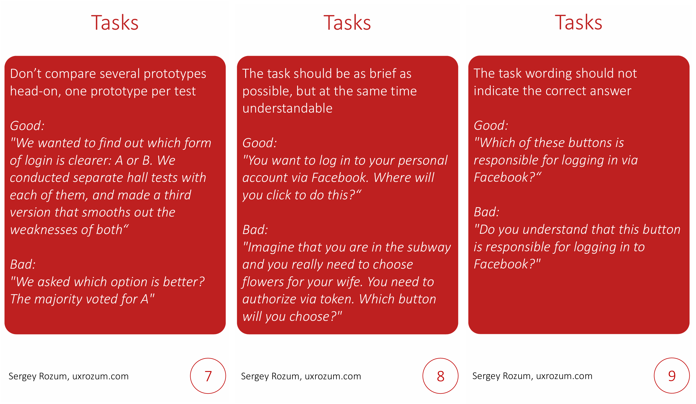

Guerilla testing is a controversial topic. Many researchers dislike it, and for good reasons.

Guerilla tests are very superficial—you don’t have the time to talk to a person long enough. You can forget about a remotely representative sample, and the target audience rarely walks around the office.

The sample size is small due to format limitations, and you don’t have the opportunity to ask about anything even moderately complex.

Still, some people continue to use it. Why? Because it’s quick, simple, and gives you the illusion of being informed. It feels like you’ve talked to people, listened to opinions—what’s not to like?

We can’t completely avoid guerilla testing, but as researchers, we can provide our colleagues with advice on making it at least somewhat useful. I’ve prepared 12 cards with tips to help smooth out most of the downsides of guerilla tests.

## Section 1: Goals and Objectives of Guerilla Testing

First, let’s clarify what value guerilla tests can actually provide. We won’t learn more about the target audience. We can’t extract opinions, user problems, or feature requests from them. However, we can test the application’s interface to see if there are any obvious design flaws.

Even if the person isn’t part of our target audience, their misunderstanding of the interface can signal to us: “Aha, something’s wrong here; we should fix it.” The exception is professional products that require specialized knowledge or education to use. Guerilla testing won’t work for a nuclear power plant interface. But for a content consumption app? Absolutely.

Text is a special case. On one hand, we can test the perception of phrases and terms. On the other hand, we must be extra careful to avoid specialized text. If our goal is to make the text understandable for everyone, it’s worth trying. If not, it’s better to skip guerilla testing.

## Section 2: Selecting Respondents

Our sample will inevitably be ad hoc, but there are still some things to consider.

First, obviously, don’t test on anyone who has any connection to the product being tested. Our goal is to find people who have never seen it, never participated in discussions, and ideally don’t even know it exists. We need fresh eyes, so we can skip our own team.

Respondent rotation remains important. Avoid testing the same person twice, even with different prototypes. Playing favorites with respondents doesn’t lead to anything good, regardless of the study type.

Ideally, we’d test with people entirely unrelated to the tech industry. Cleaners, security staff, and other support personnel are perfect for us. At the other end of the spectrum are designers and management—they see interfaces daily and are likely too experienced to provide a fresh perspective.

Personally, I’d be a bad respondent—over the years, I’ve encountered products so poorly designed that I’ve developed a skill for understanding even the most baffling interface solutions :)

## Section 3: Formulating Tasks

Guerilla testing can easily be mistaken for quantitative research—it’s tempting to count responses and conclude one interface is better than another. In reality, it doesn’t work that way. We can’t compare test results like this. While it may look like a quantitative survey, the insights are purely qualitative—potential usability issues to watch for. So let’s not compare prototypes head-to-head; it’s not great practice even in full-scale usability tests.

We don’t have time to immerse participants in the testing context. We can’t spend time explaining our goals or using icebreakers. Therefore, tasks must be as short and clear as possible—like remote usability testing, but even more concise and straightforward.

Standard research question requirements still apply: avoid leading questions, steer clear of “yes/no” questions, maintain neutrality, and account for socially desirable answers—few people want to upset a colleague.

## Section 4: Testing

Guerilla testing has strict time limits. We can’t take up too much of someone’s workday. Therefore, it’s best to limit each participant to 1–2 tasks. 

As mentioned, numbers don’t matter in guerilla testing. As they say, you don’t need to wait for a hundred cars to drive over a pothole to know it needs fixing. If we notice repeated incorrect responses, two things are clear:

* There are people who find something confusing.
* This isn’t a unique case; there are definitely more of them.

These are red flags and additional arguments for improving the solution.

Oh, and yes, don’t show desktop applications on a mobile device. You could run around with printouts, but the ideal approach is to display the interface on the device it’s meant for.

## Conclusion

Thank you for reading to the end—I hope you found this helpful. Modern product development methods push us toward fast and cheap approaches. But speed and cost-efficiency come with drawbacks: we gather less information and draw fewer conclusions. Those conclusions are less reliable. The most important thing, in my opinion, is to clearly understand the boundaries of what we’re doing. Otherwise, we risk making significant mistakes.

You can download the PDF with cards [on my GitHub](https://github.com/UXRozum/Hall-tests).
