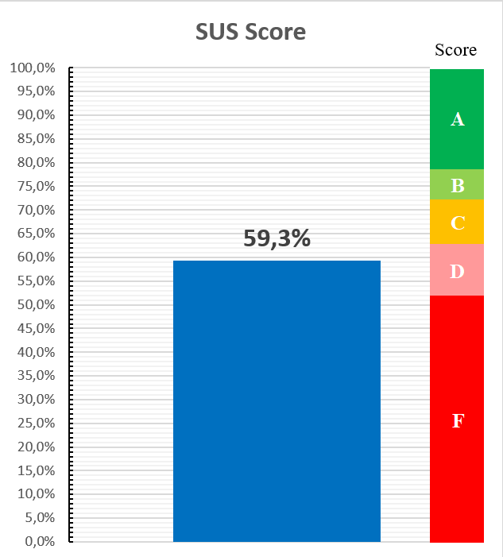

I often come across the need to count certain indexes in my work. For some of the indexes, you can find calculators (excel files where you can enter the source data and quickly get the desired index). For some of them, there are not.

And it is hard to keep everything under control. You have to dig through your files every time, remember in which excel you made calculations, remember where you left the right calculator last time.

To put this matter in order a little and make life easier for those colleagues who do not want to re-enter the necessary formulas into Excel every time, I decided to collect calculators for those indexes that I often calculate in one excel file.

I present to your attention the [Swiss Army Research Excelbook](https://github.com/UXRozum/Swiss_Excelbook). It contains methods for calculating most common indexes. Ideally, it should be as versatile as a Swiss army knife, so in the future I will supplement the methods and refine available calculators.

### Features

## Easy calsulation of metrics

Just past raw data (answers, or answer codes), and Swiss Excelbook will calculate metrics

## Tons of different metrics

What calculators are already available

* **SUM (Single Usability Metric)** - a single metric for measuring usability

* **UMUX (Usability Metric for User Experience)** - a questionnaire for measuring the usability of a product

* **CES (Customer Effort Score)** - assessment of the complexity of a particular action

* **NPS (Net Promoter Score)** - measures the loyalty of customers to a company

* **CSI (Customer Satisfaction Score)** - the index of satisfaction with the product

* **ODI (Outcome Driven Innovation)** - determining the significance of the job statement within the jtbd and the outcome driven innovation approach (Ulvik approach)

* **Kano model** - proiritize features on a product roadmap

* **PSM (Price Sensitivity Meter)** - four questions to identify the optimal product price

## Plots for every metric

Every calculated metric has a plot for study presentation 

## Benchmarks

For some metrics there are benchmarks for ease of analysis

#### How does it work?

- Download file
- Select the appropriate tab
- Insert the cleaned raw data there

The file itself has detailed instructions on what you can and can't touch, how the raw data should look like, and some tips on using the indexes themselves

You can download my Swiss Excelbook [here](https://github.com/UXRozum/Swiss_Excelbook)!