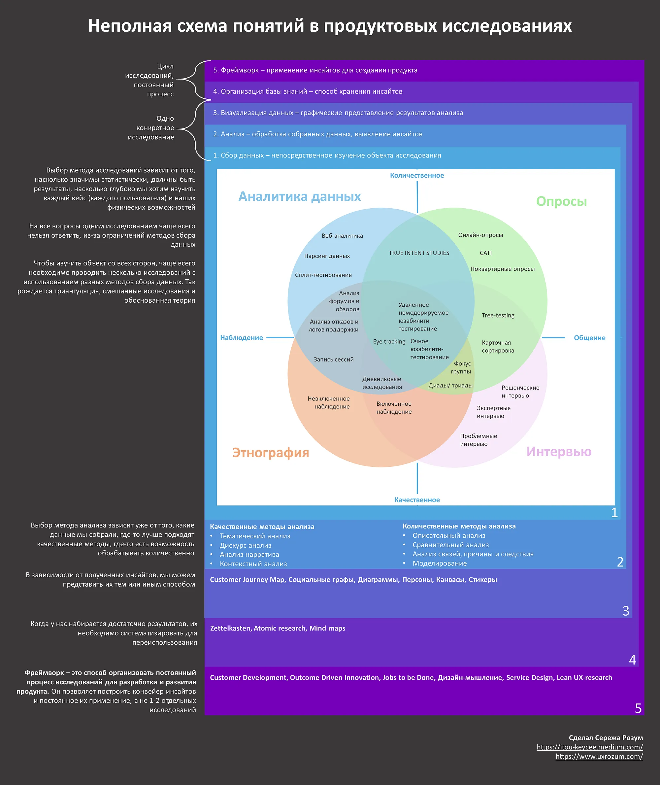

«Сходить покастдевить», «Нам нужно JTBD-исследование» — часто слышите такое? Когда мы говорим о методах исследований, в современном мире продуктовых исследований нас ждет плеяда разных интересных методов и серебряных пуль.

При этом выбор метода оказывается нетривиальной задачей. И правда, что лучше — провести глубинные интервью или заняться кастдевом, накидать JTBD-канвас или построить персоны? Глаза разбегаются.

Вокруг полно разных курсов, методичек, видео и книг. Каждая обещает научить проводить исследования, быстро и легко. Но здесь кроется один очень важный и не всем очевидный момент.

**Customer Development — это не метод исследований, Jobs To Be Done — это не метод исследований. Это исследовательские фреймворки.**

## Почему это так?

Сначала давайте разберемся с тем, что такое метод исследования.

Любое исследование начинается с исследовательского вопроса. Исследовательский вопрос — штука довольно конкретная, и относительно низкоуровневая. Например, «Какие проблемы возникают у людей при создании подкастов?» или «Какой продукт для просмотра видео на android — самый популярный?».

Исследовательский метод — это способ ответить на этот вопрос. Он включает в себя метод сбора информации (например, интервью или опрос, а может быть этнографическое наблюдение) и метод анализа информации (например, тематический анализ, или дескриптивная статистика). От исследовательского вопроса и наших возможностей зависит выбранный метод, разные методы дают разные по своим характеристикам исходные данные, и уже в зависимости от свойств данных можно выбирать метод анализа. К этой паре мы можем подключить еще метод визуализации наших результатов (к ним, кстати, относится CJM, которое некоторые тоже считают методом исследования). Эта совокупность практик работает в рамках одного исследовательского вопроса.

Но помимо точечных вопросов перед владельцем продукта встает один, главный вопрос: «Как сделать популярный и полезный продукт, который будет приносить прибыль?». Необязательно финансовую прибыль, в нашем контексте это не суть важно. Самое важное здесь то, что одним исследованием на этот вопрос не ответить — нам нужен постоянный процесс поиска новой информации.

И тут нам на помощь и приходят исследовательские фреймворки. Основная задача которых и ответить на вопрос «Как сделать этот самый крутой продукт?». **Если одно исследование — это тактика, то работа в рамках фреймворка — это стратегия. В идеале фреймворк с нами с самого начала идеи создать продукт до самого последнего пользователя. При этом они включают в себя и качественные и количественные части, то есть предлагают нам охватить как можно больше различных методов, чтобы получить максимальный охват знаний о наших пользователях.**

Для иллюстрации этой мысли я сделал небольшую (и очень неполную) схему понятий, с которыми мы сталкиваемся, когда говорим об исследовательском процессе:

Полноразмерную версию можно посмотреть [на моем гитхабе](https://github.com/UXRozum/UX-Methods-Scheme/blob/main/Product_research_scheme.pdf).

## Почему это важно?

Из разделения методов исследований и фреймворков исходит несколько очень важных следствий

#### Следствие 1: методы сбора данных дополняют друг друга

В русскоязычном интернете тот же кастдев стал синонимом глубинного интервью. На самом деле, это не обязательно так. Можно и нужно собирать данные из разных источников. Не только глубинки с пользователями, но и общение с экспертами, анализ открытых источников, опросы и прямое наблюдение — все это подходит для процесса постоянного изучения пользователей. Классический кейс из JTBD с милкшейками почему-то забывают, и сломя голову идут на амбразуру интервью. А ведь в нем исследователи сначала наблюдали за тем, что и как заказывают клиенты. Пользуйтесь всеми возможными способами лучше понять своих пользователей

#### Следствие 2: JTBD или Custdev — это не только качественные методы

Если мы работаем только качественно, то мы теряем более широкую перспективу. Наши знания о пользователе будут глубокие, но не генерализируемые. Наш product/market fit будет крайне условным, мы не сможем до релиза хотя бы примерно предсказывать, какие результаты мы получим. Поэтому оба этих фреймворка содержат в себе и качественные и количественные методы. Важно не только найти интересный инсайт, но и завалидировать его количественно. Пока у нас cutsdev — синоним глубинки, мы будем забывать добрую половину необходимых активностей.

#### Следствие 3: исследование — это не разовая активность, это постоянный процесс

Для создания хорошего продукта не надо однажды собраться всей командой и «пойти в народ», или засесть в одной переговорке на двухдневную сессию дизайн-мышления. Это так не работает, любой исследовательский фреймворк регулирует полностью создание и поддержку продукта. Начиная от продуктовой идеи и заканчивая анализом уже функционирующего продукта. Если такие активности проводятся эпизодически, разово, то пользы от них уже не так много.

В заключение хочу сказать, что все это — моё личное мнение. И основано в основном на моем личном опыте. Я могу быть неправ, могу ошибаться. Если вы не согласны — пишите, обратная связь всегда важна и полезна!

