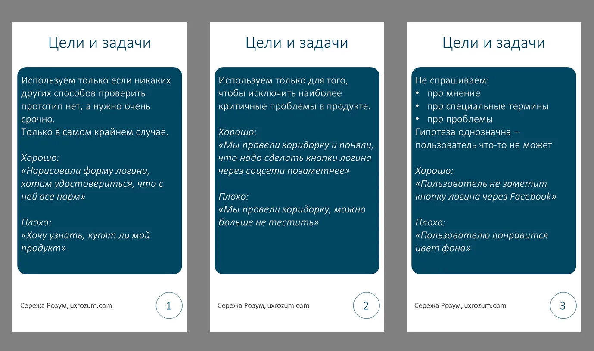
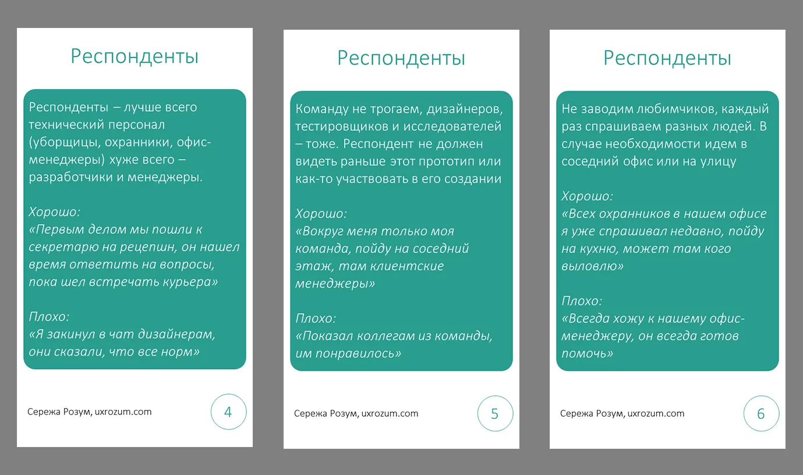

Коридорное тестирование — спорная штука. Многие исследователи не любят их, и на это есть причины.

Коридорки очень поверхностны, у тебя нет времени поговорить с человеком достаточно долго. О хоть сколько-нибудь репрезентативной выборке можно и не мечтать, целевая аудитория редко ходит по офису.

Размер выборки мал из-за ограничений формата, о чем-то более-менее серьезном у тебя нет возможности спросить.

Но все равно, есть люди, которые их делают. Почему? Потому что это быстро, просто, дает тебе иллюзию информированности. Вроде и народ поспрашивал, и мнение послушал — чем тебе не исследование?

От коридорок нам никуда не уйти, но мы, как исследователи, можем дать коллегам несколько советов о том, как их сделать хоть сколько-нибудь полезными. Я подготовил 12 карточек с советами, которые помогут сгладить большинство отрицательных сторон коридорных тестов.

## Раздел 1: цели и задачи коридорок

В первую очередь стоит разобраться с тем, в чем вообще может быть польза от коридорок. Больше про целевую аудиторию мы от них не узнаем. Какое-либо мнение, проблемы пользователей, запросы на фичи — ничего из этого мы не вытащим. Однако, мы можем проверить интерфейс приложения — а нет ли там очевидно неудачных решений?

Даже если человек не наша целевая аудитория, непонимание им интерфейса может служить для нас сигналом: “Ага, тут что-то не так, надо бы это поправить”. Ограничение тут — профессиональные продукты, использование которых подразумевает наличие у человека специальных знаний и образования. Коридоркой интерфейс атомной станции мы не протестируем. А вот приложение для потребления контента — можем.

Отдельно хотелось бы сказать про тексты. С одной стороны, мы можем пощупать восприятие текстовок и терминов. С другой стороны — здесь нам надо еще сильнее следить за тем, чтобы текст не оказался специализированным. Если наша задача — сделать текст понятным для всех — можно попробовать. Если нет — то лучше отказаться от коридорных тестов.

## Раздел 2: как отбирать респондентов

Конечно, выборка у нас в любом случае будет стихийной. Но все равно нам стоит учитывать некоторые вещи.

В первую очередь, очевидно, не стоит спрашивать тех, кто имеет хоть какое-то отношение к тестируемому продукту. Наша задача — найти тех, кто никогда его не видел, не участвовал в обсуждении, идеально конечно, чтобы не знал о его существовании. Нам нужно найти тех, у кого еще не замыленны глаза нашим продуктом, свежий взгляд. Так что собственную команду можем не доставать.

При этом, ротация респондентов никуда не уходит. Стараемся не спрашивать одного человека дважды, даже если это разные прототипы. Заведение любимчиков среди респондентов не приводит ни к чему хорошему, какое бы исследование это ни было.

Идеально, конечно, было бы поспрашивать людей, которые никак не относятся ко всей этой нашей ойти индустрии. Уброрщики и уборщицы, охранники и охранницы, любой “обслуживающий” персонал — идеально для нас. С другой стороны спектра дизайнеры и менеджмент — они постоянно видят различные интерфейсы, тут слишком высок шанс, что человек уже достаточно насмотрен, чтобы разобраться в чем угодно.

Лично я буду плохим респондентам — за время своей работы мне приходилось разбираться в продуктах настолько чудовищных, что я уже выработал у себя навык понимания любых возможных интерфейсных решений :)

## Раздел 3: формулировка заданий

Коридорку легко спутать с количественником — ведь легко посчитать ответы и прийти к выводу, что один интерфейс лучше другого. На деле это не так, мы не можем сравнивать результаты тестов. Хоть оно и выглядит как количественный опрос, инсайты тут будут исключительно качественные — потенциальные юзабилити проблемы, на которые стоит обратить внимание. Поэтому давайте не сравнивать прототипы лоб в лоб, это и на полноразмерном юзабилити-тесте не очень хорошая практика.

У нас нет возможности погрузить человека в контекст тестирования, мы не можем долго рассказывать про наши цели, заморачиваться с айс-брейкерами тоже нет времени. Поэтому и задание5 должно быть максимально коротким и понятным. Как при удаленных юзабилити-тестах, но только еще короче и понятнее.

Ну и стандартные требования к вопросам в исследовании никуда не уходят. Не указываем на правильный ответ, не задаем “да/нет” вопросы. Сохраняем нейтральность и всегда имеем в виду социально одобряемые ответы — мало кто захочет обижать коллегу.

## Раздел 4: проведение тестирования

У коридорных исследований строгие временные рамки. Мы не можем сильно отвлекать народ от работы. Поэтому не рекомендуется давать много заданий для одного респондента. Идеальная коридорка состоит из 1–2 заданий.

Как я уже говорил, цифры в коридорке считать бесполезно. Как говорится, тебе не нужно ждать, пока сотня машин проедет по канаве на дороге, чтобы понять, что ее нужно заделать. Если мы видим повторение неправильного ответа, мы можем сказать две вещи:

* Существуют люди, которым что-то непонятно

* Это не уникальный случай, таких людей точно больше одного

А это уже тревожные звоночки и дополнительные аргументы к доработке решения.

Ну и да, показывать десктопные приложения на мобилке не стоит. Можно, конечно носиться с распечатками, но идеальный вариант — показывать интерфейс на том устройстве, на котором он будет использоваться в реальной жизни.

## В заключение

Спасибо за то, что дочитали статью до конца, надеюсь вам понравилось. Современные методы разработки продуктов заставляют нас использовать быстрые и дешевые методы. Но скорость и дешевизна обычно несут за собой минусы — м получаем меньше информации, можем делать меньше выводов. Выводам этим мы можем меньше доверять. Здесь самое важное, на мой взгляд — четко понимать границы того, что мы делаем. Иначе мы рискуем сильно ошибиться.

Пдф с карточками на русском и английском языках можно скачать [на моем гитхабе](https://github.com/UXRozum/Hall-tests).