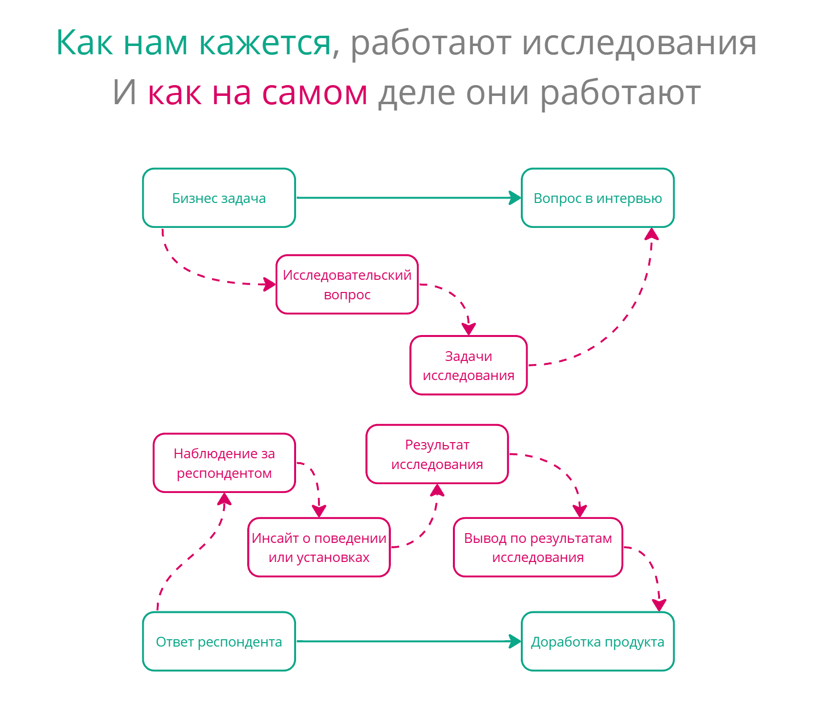

*TL;DR: Наш подход к инновациям некорректен, и это приводит к проведению бесполезных исследований. Давайте использовать более подходящий язык для описания и исследований и инноваций, и все встанет на свои места.*

## Disruptive innovations

Когда мы говорим про инновации, на ум сразу приходит нечто грандиозное. В массовой культуре владелец стартапа — это всегда человек, который стремится изменить мир. В культуре продуктовой разработки до сих пор живет и здравствует такое понятие как “disruptive innovation” — инновация, которая в корне меняет рынок. Оно противопоставляется понятию “sustaining innovation” — та инновация, которая просто улучшает уже существующие продукты.

Термин “Disruptive inovation” был популяризирован Клейтоном Кристенсеном в статье “Disruptive Technologies: Catching the Wave”. Статья посвящена развитию характеристик техники и отношению компаний к этому развитию. Там он говорит о том, что развитие конкретного технического атрибута продукта (например, качество звука у радио) часто сталкивается с пределом современной технологии. “Подрывными” становятся те технологии, которые развивают, казалось бы, менее важные атрибуты в ущерб основным и тем самым создают новые рынки и применения технологии. Например, Sony пожертвовали качеством звука для создания портативных радио. Соответственно, в статье делается вывод о том, что нужно меньше слушать пользователей и обращать больше внимания на технологии, которые кажутся не отвечающими их потребностям. Новые технологии создают новые рынки и новых пользователей.

Если говорить о технологиях, то это вполне понятная мысль. Однако зачастую владельцы продукта переносят это понимание из исключительно технологической плоскости в плоскость смысловую. Нам кажется, что правильный продукт радикально изменяет устоявшиеся привычки. Приводят в пример Амазон, Нетфликс, Твиттер, которые буквально перевернули с ног на голову многие привычные людям вещи. Ведь если люди не могут быть правыми относительно необходимых им технических характеристик, то можно и не ориентироваться на их привычки и мнение — привыкнут, поменяются.

На самом деле все происходит наоборот. Продукт или технология никогда не является источником перемен в поведении человека. Чем лучше продукт встраивается в наше привычное потребление, чем лучше мы можем подстроить и приспособить его для наших нужд, тем больше у него шансов произвести “революцию на рынке”. Неправильное же понимание приводит к тому, что из сферы технических характеристик продукта мы переносим принцип disruptive innovation на саму жизнь нашего потенциального пользователя.

В этом контексте люди любят упоминать якобы Генри Форда с рассказом о том, что если бы он спросил человека, что ему нужно, он получил бы ответ “Более быструю лошадь”. Мы упускаем тот момент, что даже если Форд и не сделал буквально более быструю лошадь, он все равно исходил из уже существующих привычек использования машин. Например, первые тракторы использовались не только как средство передвижения, они позволяли использовать двигатель как движущую силу для выполнения различных сельскохозяйственных операций — автомобиль достаточно удачно встраивался в повседневную жизнь человека. И только потом общество переварило появление автомобилей, выработало новые паттерны и дало толчок дальнейшему развитию автомобилестроения.



Если мы обратимся к собственному опыту использования цифровой техники, то мы обнаружим, что причинно-следственная связь у нас не прямая, а цикличная. Не “продукт → поведение”, а “поведение → продукт → поведение”. Инстаграм не научил людей выкладывать фотографии в интернет или обрабатывать их. Он упростил привычное людям действие. После чего люди приспособили этот продукт к привычным им паттернам. И уже только после этого началось развитие практики постинга фоточек.

Человеческие привычки и паттерны общения являются наибольшим источником для инноваций, а не наоборот. Чтобы инновация была успешной, она должна не менять жизнь. На первых порах она должна в нее встраиваться.

## Трагедия милкшейка

Простой пример из моей жизни. В моей спальне стоит обогреватель. Обогреватель подключен к интернету и у него есть отдельный пульт управления. Очевидно, что отдельный пульт удобней, чем приложение на телефоне — тебе достаточно протянуть руку и нажать на кнопку, чтобы его включить. В телефоне же надо зайти в приложение, выбрать там обогреватель и уже потом включить.

Но я заметил за собой следующее поведение: когда я лежу в кровати перед сном, я включаю обогреватель с телефона, а не пользуюсь более простым и удобным решением в виде пульта, который лежит тут же рядом, на кровати. Почему это так? Ответ прост: телефон у меня и так всегда в руке. Смартфон - это продолжение меня и мне проще сделать несколько кликов в нем, чем переключать контекст на отдельное устройство. Использование телефона лучше встраивается в мою повседневную жизнь, чем использование казалось бы более удобного пульта.



Если не учитывать контекст использования продукта, то можно сделать много решений, которые кажутся логичными и удачными, которые очевидно ведут к упрощению жизни человека. Но данные решения не будут достаточно популярными — пользователям необходимо будет слишком сильно подстраиваться под их использование. Новые продукты и фичи должны быть как недостающий кусок мозаики, они должны подходить к тому, что происходит вокруг человека. В попытке делать развитие продукта революционным, мы просто совершаем насилие над пользователем.

Это вполне очевидная мысль, и она раз за разом проговаривается в фреймворке Jobs to Be Done. Один из популяризаторов этого фрейморка — тот же самый Кристенсен, популяризатор термина “Disruptive Innovations”. JTBD известен и популярен, и предполагает изучение контекста использования продукта. Но, по моему опыту наблюдений за практикой использования этого фреймворка, мы совсем не понимаем его суть. Не только мы, а возможно и сам Кристенсен.

Мое отношение к JTBD довольно сильно менялось со временем. Сначала для меня это был просто набор модных хипстерских словечек для людей, которые не учились маркетингу. Потом он в моем понимании он вырос до фреймворка создания продукта, удачной метафоры для IT-специалистов. Он как бы выстраивает собственную терминологию, которая более удачно описывает структуру человеческой потребности для “технарей”.

Но сейчас я понял, что на самом деле JTBD содержит в себе довольно мощную интуицию самой сути процесса создания инноваций. Как мне кажется, Кристенсен не до конца справился с тем, чтобы корректно это передать, а трижды переваренный различными курсами и упрощениями, JTBD окончательно потерял эту суть для многих.

Очень показателен для этого уже забитый до невозможности кейс с милкшейком (который еще и был в последствии опровергнут в Jobs to Be Done Playbook Калбаха). Его используют как пример инновации, которая резко подняла продажи молочных коктейлей. Не буду его пересказывать, почитать можно тут. Кажется, все просто - поговори с человеком, пойми зачем он использует тот или иной продукт, “на какую работу он его нанимает” (в особо отмороженных случаях спрашивают напрямую) и вот он тебе скажет, что ему на самом деле нужно и какую фичу запилить.

На деле же все сложнее. Привычка поесть перед работой была всегда, и будет, независимо от того, есть коктейль или нет. Коктейль позволяет перекусывать по дороге на работу с как можно меньшим количеством телодвижений. И уже после изучения процесса перекуса в дороге до работы, создателям коктейля пришло в голову понимание, что увеличение густоты коктейля позволит его более удачно в этой практике использовать. Несмотря на глубину и показательность этого кейса, чаще всего его понимают просто как “Ну поговори с пользователем, пусть он скажет, что ему нужно”. Я считаю это трагедией.

Термин Disruptive Technologies, который ввел Кристенсен, и кейс из его же фреймворка в “популярном переводе” говорят нам противоположные вещи. Мы одновременно не должны обращать внимания на потребности пользователей, но мы должны говорить с ними, чтобы они нам сказали, какие свойства им нужны.

## Снимаем противоречие

Однако это противоречие возникает только тогда, когда мы неправильно понимаем то, что JTBD пытается до нас донести.

Кристенсен довольно четко разделяет для себя понятия “функция” и “работа”. Казалось бы, синтаксический сахар. Но нет, это разделение невероятно важно для понимания процесса использования продукции. Слово “работа” обозначает тот факт, что пользователь подстраивает продукт под себя, а не подстраивается под продукт.

Люди не общаются на форумах потому что там можно общаться. Форум не является источником общения. Люди научились использовать форумы для общения. Вроде бы одно и то же, но если посмотреть с позиций разработки продукта, то это диаметрально противоположное. Мы не должны придумывать новую функцию, которая побудит людей проводить у нас больше времени. Мы должны предоставить возможность людям подстроить продукт под большее количество уже действующих обычаев, чтобы они могли легко перенести их к нам, и уже тогда они будут чаще пользоваться нами.

Слова невероятно важны. То, как мы о чем-то говорим, может многое показывать. Например, хорошим маркером некорректного отношения к исследованиям является фраза “Пусть пользователи скажут, как лучше”. Как и в случае с коктейлем, мы ожидаем, что если задать вопрос в правильной формулировке, люди скажут “Надо бы, чтобы он погуще был”, после чего мы несем это сразу же в разработку. И вот она инновация, рост метрик, новые рынки. Но на самом деле такого прямого процесса не существует.

Наша бизнес-задача проходит долгий и мучительный процесс операционализации. В обратную сторону то же самое - наблюдения превращаются в инсайты, инсайты в выводы, выводы в решения. Мы не спрашиваем у пользователей, как нам быть и что делать. Изучая людей мы выделяем те действия, в которых использование нашего продукта может с наименьшими издержками со стороны пользователя упростить ему их исполнение, и у каждого человека могут быть разные издержки. Для этого мы и проводим исследования. Отрефлексировать и понять, почему я использую телефон вместо пульта я смог только благодаря тому, что как исследователь, я могу посмотреть на свое поведение с разных точек зрения. Это мой главный навык и хлеб. И странным будет ожидать такую рефлексивность от людей, которые не занимаются в своей работе изучением чужого поведения. Ожидая от пользователя подобной рефлексии на тему использования цифровых продуктов, мы перекладываем работу исследователя и владельца продукта на него.

В JTBD в обыденном его понимании эта очень важная тонкость уходит. Возможно потому что сама дихотомия “функция/работа” — это не самый удачный язык для описания того, что происходит. Нам кажется, что мы работаем напрямую с мнением, тогда как нам необходимо изучение поведения. Вот здесь то нам на помощь и приходит социология. Для того, чтобы придумать качественную инновацию, мы должны изучать действия, многие из которых не рефлексируются пользователями. Здесь нужна новая для продуктовых исследований оптика.

## Исследовательская оптика и язык описания

Бруно Латур и его “Пересборка социального” довольно сильно перевернули для многих понимание того, как мы должны изучать и описывать общество и процессы в нем. Латур много говорит о том, что мы должны как бы картографировать общественный ландшафт. В Акторно-Сетевой Теории субъектами общества становятся не только люди, но и все, что их окружает.

>Велика или мала разница между женщиной за рулем, снижающей скорость возле школы, увидев желтый знак «не более 30 миль в час», и водителем, замедляющим движение, чтобы не повредить подвеску своего автомобиля, которой грозит удар о «ловушку для автолихачей»? Велика, потому что конформность первой мотивирована моралью, символами, дорожными знаками, желтым цветом, а второго — тем же перечнем, к которому прибавилась заботливо предусмотренная бетонная плита. Но и мала, поскольку оба чему-то повинуются: первая — нечасто проявляемому альтруизму: если бы она не снизила скорость, ее совесть замучил бы моральный закон; второй — изрядному себялюбию: если бы он не замедлил движения, подвеска его автомобиля разбилась бы о бетонную плиту. Должны ли мы здесь сказать, что только первое отношение является социальным, моральным или символическим, тогда как второе объективно и материально? Нет. Но если мы скажем, что оба отношения социальны, то как обосновать разницу между моральным поведением и пружинами подвески? Отношения могут не быть социальными на протяжении всего пути, но, безусловно, их собрала или связала вместе уже сама работа инженеров, проектировавших дорогу. Нельзя называть себя социологом и следовать лишь за некоторыми связями — моральными, правовыми и символическими, останавливаясь, как только между ними окажется вкрапленным какое-то физическое отношение. Это сделало бы невозможным какое бы то ни было исследование.  
*– Б. Латур, “Пересборка социального. Введение в акторно-сетевую теорию”*

Мы не должны упускать ничего из вида. Каждая мелочь, вроде мусорки и двери, может оказывать влияние на наши практики и поведение. Как исследователи в цифровом продукте, мы должны изучать то, как люди производят свои практики, при этом в нашей оптике цифровые продукты и устройства должны быть такими же субъектами взаимодействия, как и люди.

В начале своей статьи я говорил о том, что мне проще включать обогреватель в спальне в телефоне, потому что чаще всего я уже держу его в руке и не хочу переключать свое внимание на пульт, который лежит рядом. Казалось бы, логичный вывод - чем ближе объекты друг к другу, тем проще нам с ними взаимодействовать. А вот и нет!

Рассмотрим обратный пример. Когда мне необходимо быстро переключаться между двумя вкладками в браузере я разделяю их на два разных окна. Казалось бы, переключение окна - лишняя операция, а вкладки и придуманы за тем, чтобы не тратить время на переключение между окнами. Но я и так постоянно переключаюсь между окнами, сочетание “alt+tab” уже забито в моей подкорке, поэтому мне быстрее переключаться между двумя окнами, чем между двумя вкладками в одном окне. Описать этот паттерн было бы невозможно без понимания свойств системы и того, как происходит переключение. Горячие клавиши и принципы их работы тут - такой же участник взаимодействия. Я использую эту фичу не потому что она удобнее в вакууме. А потому что в этой конкретной операции она лучше встраивается в мой привычный паттерн использования компьютера.

Чтобы грамотно использовать данную оптику, нам также потребуется немного другой подход к исследованиям. Среди продуктовых исследователей он во многом понятен, настолько, что нам кажется очевидным. Но мне кажется это важно проговорить снова. Основной метод в нашей работе - это не интервью, а наблюдение. Даже когда мы говорим с человеком, мы наблюдаем за его ответами и уже на основании наших наблюдений делаем какие-либо выводы. С JTBD то же самое. Кейс милкшейка возможен не потому что мы правильно спросили у клиентов, а клиенты правильно ответили. Он стал возможным только благодаря грамотному и, главное, подробному описанию практики предрабочего перекуса. Это описание не было бы возможно без наблюдения, а в самом описании этого кейса оно видно — сначала специалисты стояли на стоянке и наблюдали, кто и что покупает и в какой ситуации. И уже потом поговорили с людьми, чтобы понять, почему происходит именно так. Лучшее JTBD-исследование, лучшее исследование для инновации — это наблюдение.

## Дальнейшие перспективы

В идеале здесь логично было бы обратиться к более академической среде. Потому что этнометодология использования цифровых продуктов была бы тут невероятно кстати. Но, к сожалению, большого количества трудов здесь не найти. Цифровая этнография сейчас больше направлена на анализ цифровых артефактов человеческой деятельности, а не на то, как они эту деятельность производят. Поэтому нам скорее придется самим рефлексировать опыт использования цифровых продуктов именно через оптику акторно-сетевой теории. К чему я всех и призываю.

Давайте стремиться картографировать практики наших пользователей так же подробно, как убеждает нас это делать Латур. Процесс использования цифрового продукта - очень сложный и составной, а мы сейчас его схлопываем. И цепочка “найти картинку гугле, скопировать ее, почистить от ватермарок и обрезать в фотошопе, затем вставить в презентацию в powerpoint” превращается в “добавить картинку в презентацию”. Именно в подробном изучении и описании практик использования цифровых устройств и продуктов кроется ключ для создания успешных инноваций. Развернутые описания практик — ключ успешного поискового исследования.

Пока мы будем воспринимать наши исследования упрощенно, а инновации - как революцию, мы будем обречены разрабатывать наши продукты буквально методом тыка. Это не так уж и плохо, особенно с учетом того, что современные фреймворки разработки сейчас стремятся к снижению цены ошибки. Но если уж и заниматься исследованиями, то давайте делать это наиболее эффективно. Чем больше будет элемента наблюдения в исследовательской работе, тем более полезными будут наши инсайты. Чем больше подход к инновациям будет направлен не на произведение революции, а на встраивание нашего продукта в привычные паттерны, тем более полезными станут наши продукты.

Если вам понравилась статья, не стесняйтесь ей делиться, пишите свои комменты и обратную связь на mail@uxrozum.com, или в [telegram](t.me/keycee).
