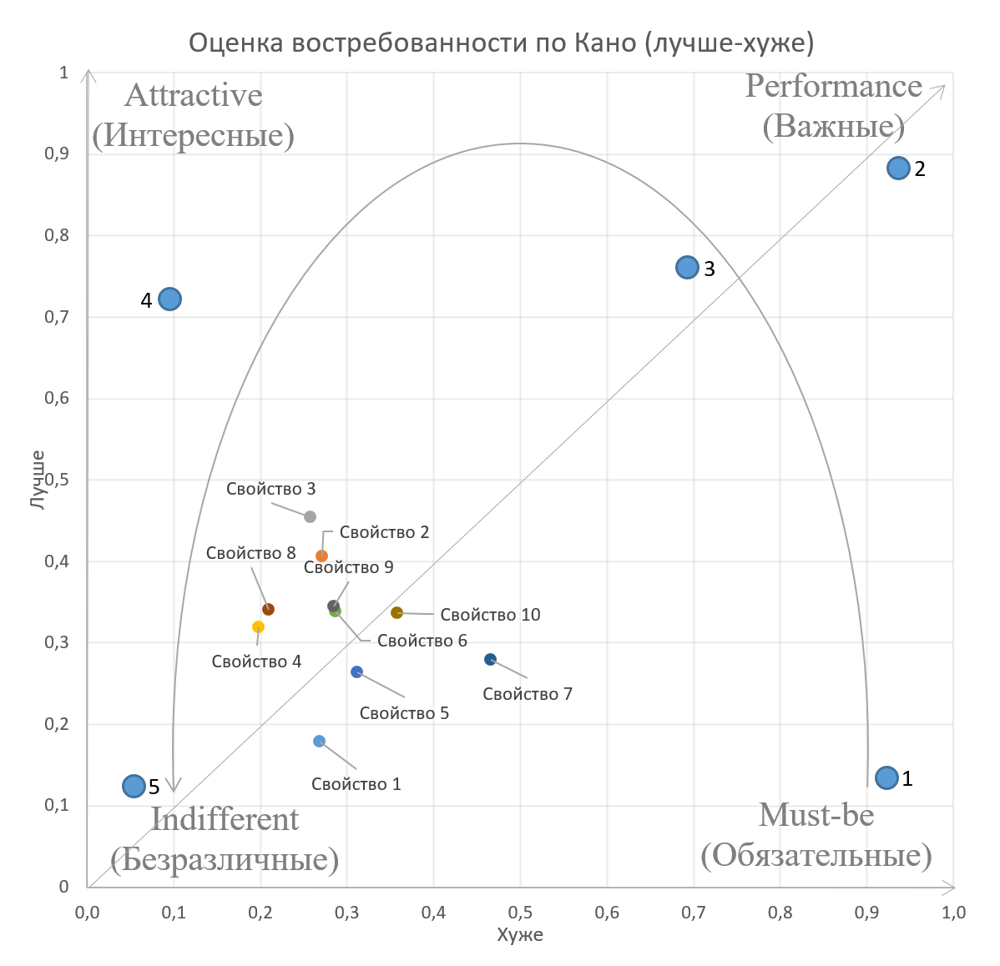

Модель Кано — довольно часто используемый способ приоритизации функций и атрибутов продукта. Она неплохо справляется, когда нужно понять, что делать в первую очередь, а что можно вообще не делать. В этом лонгриде мы поговорим об истоках этой модели и чуть поглубже копнем в методы расчетов по ней.



Теоретические истоки модели Кано

Нориаки Кано — профессор университета Токио. В основном он известен за свои работы по оценке качества. Основной работой, которая дала начало модели Кано, можно считать “Attractive Quality and Must-Be Quality”, опубликованную в журнале японского сообщества контроля качества в 1984 году. Ее мы и будем разбирать.

Объективное качество и субъективное качество

Изначально качество воспринималась довольно однозначно в инженерном смысле. Качество материалов, долговечность, точность, качество выполнения основной функции инструмента.

Соответственно, модель была довольно понятной — улучшаем все возможные свойства продукта, чем лучше будет каждое свойство, тем лучше будет продукт.

При описании подобной парадигмы Кано говорит об Ульяме Шухарте и его книге [Economic Control of Quality Manufactured Product (1931)](https://isbnsearch.org/isbn/9781614278115). В ней мы видим одни из первых подвижек в понимании качества именно так, как его определяет Кано. И Кано, и Шухарт ссылаются на Аристотеля и Локка, но наиболее близко мы это видим именно у Шухарта.

Шухарт определяет два аспекта качества:

* Объективное качество — набор атрибутов, который отличает один продукт от другого, эти качества объективны и не зависят от наблюдателя.

* Субъективное качество — то, что мы думаем, чувствуем и ощущаем в результаты столкновения с объективной реальностью.

При этом субъективное качество близко к пользе или ценности, которую мы получаем от объективных качеств продукта.

Почему это важно? Потому что, когда мы улучшаем или создаем с нуля продукт, в первую очередь нам стоит подумать не о его объективных качествах в вакууме, а о той пользе, ценности, которую они приносят пользователям.



В первой половине двадцатого века этому не придавалось основного значения, господствовала скорее инженерное понимание качества.

Однако в пятидесятых годах в этой парадигме исходят изменения. Тут Кано ссылается на Уильяма Эдварда Деминга, и некий его труд "Самый полезный и покупаемый продукт", 1950го года. Если честно, ни статьи такой, ни книги у Деминга я не нашел, но нашел его выступление в 1950-ом году, которое называется "[Lecture to Japanese Management](https://hclectures.blogspot.com/1970/08/demings-1950-lecture-to-japanese.html)”. Там Деминг говорит:

>"Наиболее полезный” значит то, что дизайн и качество продукта должны следовать его назначению. Материалы, техника производства, логистика и сами продукты должны быть лучшими с точки зрения потребителя и рынка. Если вы не будете проводить рыночные исследования (опросы) про то, какие качества и какой дизайн продукта востребованы, ваши продукты не смогут быть "наиболее полезными”

Судя по всему, эти слова очень сильно запали в душу японского менеджмента, и впоследствии там появилась целая плеяда исследователей качества.

Но еще более важен для нас Армант Ф Фейгенбаум, который постулирует не только разницу между объективным и субъективным качеством, но и ведущее значение субъективного качества — ведь именно оно больше всего влияет на цену продукта.

>Качество продукта — это компромисс между его объективным качеством и доступностью до степени, которая будет отвечать ожиданиям клиента



Что это значит для нас? Это значит то, что мы можем бесконечно много денег тратить на улучшение продукта. Но если мы будем улучшать все качества сразу, а не те, которые важны пользователям, мы не сможем продавать наш продукт. Он будет дороже в производстве, чем его рыночная стоимость. Улучшение только важных качеств продукта — это не прихоть, и не альтруизм. Это экономическая необходимость.

## Гигиенические факторы мотивации

Мы разобрались с первой частью теоретических основ модели Кано. До для полного ее понимания нам стоит рассмотреть и вторую. Ее истоки лежат в теории мотивации трудовой деятельности.

Напрямую Кано об этом не пишет, и сразу переходит к объяснению разных групп свойств качества. Но мне это кажется особенно важным. В [Literature Review of The Kano Model (2017)](https://www.diva-portal.org/smash/get/diva2:1080839/FULLTEXT01.pdf) Хартманн и Лебгерц пишут, о том, что Кано и его коллега Фумио Такахаши шли от понятия гигиенического фактора мотивации для объяснения Must-be качеств продукта.

Гигиенические факторы мотивации были введены в научный обиход Фредериком Герцбергом. В своей статье “[One more time: How do you motivate employees?](https://www.insidemarketing.it/wp-content/uploads/2020/08/one_more_time_-_how_do_you_motivate_employees.pdf)”, Герцберг разделял два типа факторов:

* Гигиенические факторы — неудовольствие которыми ведет к неудовлетворенности работой

* Мотивационные факторы — удовлетворенность которыми ведет к удовлетворенности работой

Интересный момент — для разных людей одни и те же факторы могут быть как гигиеническими, так и мотивационными. Потихоньку приближаемся к нашей модели!

Соответственно, здесь мы можем сделать следующую табличку:

Именно эти факторы Кано и называет Performance Quality (Мотивация) и Must Be Quality (Гигиена).

Назвав две эти группы атрибутов, Кано пошел дальше — обозначил не только «Удовлетворен” и »Неудовлетворен”, а еще добавил и нейтральную позицию:

Так мы получаем “Indifferent” — безразличные фичи

И так же, он добавил качество, обратное от гигиентического:

Таким образом обратное к гигиене становится Attractive Quality (Интересное). И тут мы выходим с вами к названию оригинальной статьи!

*Главное теоретическое новшество Кано (на мой взгляд) было именно в том, что он дошел до анти-гигиены, вау-фичи, качества, отсутствие которого не делает хуже, а наличие — делает лучше.*

## Синтез

А теперь давайте попробуем объединить идеи Шухарта и Герцберга в одну модель.

Сначала мы нарисуем объективное и субъективное качества продукта:

Объективное и субъективное качества не находятся в прямой корреляции, но для удобства мы обозначим их перпендикулярными линиями

Обозначим на ней «гигиену» и «мотивацию» по Герцбергу:

И добавим в нее те качества, которые домыслил Кано:

И вот мы получили ту самую модель Кано, с которой мы начинали! Назовем же их всех, слева направо:

* **Обязательные (Must-be)** — это основные фичи продукта, присущие им по умолчанию

* **Важные (Performance)** — фичи, уровень реализации которых влияет на уровень удовлетворенности потребителя напрямую

* **Интересные (Attractive)** — это нечто неожиданное для потребителя, киллер-фича

* **Безразличные (Indifferent)** — фичи, наличие или отсутствие которых ни на что не влияет

*Почему это важно? Модель Кано — это не просто абстрактная модель, выдуманная в подвалах Токийского университета загадочным японским волшебником. Это модель, которая показывает нашу возможность управлять качеством нашего продукта для уменьшения издержек на производство и увеличение удовлетворенности пользователей. Использовать ее стоит не потому что это круто и модно, а потому что она позволяет извлекать максимальную пользу из наших затрат на разработку.*

## Способы расчета

Чтобы оценить влияние определенной функции на субъективное качество, Кано предлагает задавать два вопроса:

* Как человек отнесется к тому, что в продукте есть некая функция (или какой-то атрибут сделан хорошо)

* Как человек отнесется к тому, что в продукте нет некой функции (или какой-то атрибут сделан плохо)

Дословный перевод с японского. Самое интересное, что сам Кано еще использует вариант ответа “Другое”. Но как он его обрабатывает, не очень понятно.

Больше всего из русскоязычных формулировок мне нравятся те, которые использует [Фастуна](https://app.fastuna.ru/questionnaire/KanoRanking):

Здесь еще добавлен вопрос по понятности, полезная штука, чтобы отсеять непонятные пользователю фичи. А некоторые еще предлагают использовать дополнительную оценку важности, на мой взгляд это излишнее.

Затем в зависимости от сочетания ответов на эти два вопроса, мы относим свойство (атрибут, фича, в нашей статье это взаимозаменяемые термины) к той или иной группе по модели. Про это мы еще поговорим подробней в следующем разделе.

Сам Кано использовал в своей работе только прямой количественный расчет. Хотя, из интересного, он смотрел не только общую удовлетворенность, но и распределение ее в зависимости от социально-демографических групп потребителей:

В своей статье он говорит, что можно было бы суммировать распределение по разным атрибутам, чтобы получить сводную оценку.

>Можно оценить эффект устранения неудовлетворенности и эффект повышения удовлетворенности, полученный путем устранения «недостаточности» и замены ее на «достаточность» следующим образом:Эффект устранения неудовлетворенности = Важные (Performance) + Обязательные (Must-be) Эффект повышения удовлетворенности = Интересные (Attrative) + Важные (Performance)

Но очень далеко в интеграции оценки Кано не заходит. Поэтому дальнейшее развитие методов расчета мы с вами будем изучать по замечательной статье "[Kano’s method for understanding customer-defined quality (1992)](https://www.academia.edu/29830721/Kano_s_method_for_understanding_customer_defined_quality)”.

## Количественный способ — логический квадрат

Самый простой способ расчета по модели Кано — посчитать, какой процент респондентов относит фичу к той или иной группе.

Для этого используется логический квадрат, одна из базовых техник для формирования социологических индексов (почитать про это подробнее можно [тут](https://www.pedlib.ru/Books/2/0252/2_0252-64.shtml)).

В нашем случае это скорее прямоугольник, и матрица принятия решения выглядит следующим образом:



Здесь вы могли бы заметить, что помимо 4 базовых у нас есть дополнительные группы:

* Сомнительные (Questionable) — скорее всего непонятные фичи, их стоит перепроверить

* Нежелательные (Rewerse) — те фичи, наличие которых, наоборот, ведет к неудовлетворенности

Распределение ответов по каждой функции можно разместить на таком прямоугольнике:



Если перевести количество “попаданий” в проценты и свести все свойства в одну табличку, мы получаем следующее:



То есть мыслим мы буквально количеством, та группа, которую “выбирает” большинство — является истинной группой для фичи.

Также мы можем эти результаты отобразить в диаграмме, как и делал Кано:

И тут, скорее всего, можем сделать примерный вывод, что лучше сначала сделать свойства 3, 7 и 8. А на свойства 10, 2 и 5 лучше не тратить много ресурсов.

Здесь мы сталкиваемся с основной проблемой такого анализа “в лоб”:

* У нас 6 разных критериев для сравнения. Сложно однозначно понять, какой аттрибут более важный, а какой — менее. Впоследствии это может приводить к спорам в команде.

* Вероятность попасть в негативные группы (Безразличная, Сомнительная, Обратная) более чем в два раза больше вероятности попасть в позитивные группы (Обязательные, Важные, Интересные). Многие функции будут попадать в болото безразличных, особенно для сложных продуктов (где не так очевидны преимущества). Да и респондентам проще давать нейтральные оценки, чем положительные/негативные.

Чтобы избежать первого, можно договориться внутри команд о том, на какие группы обращать внимание в первую очередь, либо суммировать положительные (как предлагал Кано).

Чтобы избежать второго, важно как можно более четко описывать свойство и его преимущества. Чем понятнее расскажем, тем больше шанс, что получим мнение, близкое к реальности.

Но, научная мысль не стоит на месте, поэтому сейчас мы посмотрим более интересные способы расчета наших результатов!

## Интегрированный способ — взвешенные оценки

Как я уже говорил ранее, высок шанс, что фича попадет в безразличные. Тут играет не только сам шанс попадание, но и свойство людей скорее давать средние оценки, чем крайние.

Уильям ДюМошель (надеюсь я правильно транскрибировал) из CQM Research предложил попробовать “взвесить” получанные результаты.

Здесь мы вместо логического квадрата используем оценку баллами. Каждый ответ респондента прибавляет или убавляет баллы, и средняя их оценка может быть единой мерой.

И при этом мы можем давать больше баллов за положительные ответы, чтобы меньше фич уползали в безразличные.

Модель Кано предполагает сравнение свойств между собой, а не в абсолюте, в этом контексте у нас не должно быть много проблем с весами. Против истины мы тут не грешим.



Посчитав средний бал по наличию и отсутствию для каждой фичи, мы получаем следующую табличку:

Вместо 6 критериев мы оставляем 2, уже неплохо. По данным из таблички можно построить уже знакомый многим график:

Лучше в нашем гипотетическом случае не стало, но 3,8 и 7 свойства можно выделить чуть более четко

Здесь вы могли бы заметить, что негативные оценки у нас буквально ниже нуля. И спросить “Сережа, а где отрицательные значения на графике?” .

Здесь мы вернемся на шаг назад и немножко расширим наш график:

В полной таблице в отрицательные значения попадают в основном негативные группы, а в позитивных остаются только четыре основные группы (закрашенная часть) . Поэтому если вдруг свойства пропадут с графика — не пугайтесь: )

## Интегрированный способ — “Лучше-Хуже”

С помощью расчета баллами и весами мы смогли немного снизить неопределенность в ранжировании свойств, но единой меры распределения у нас все же нет.

Тут мы можем попробовать интегрированную оценку, которую предлагал Кано (складывать проценты попадания групп), но Майк Тимко из Bose Analog Devices предлагает более интересный способ.

Он вводит две меры, которые показывают увеличение и снижение удовлетворенности пользователей в зависимости от наличия или отсутствия фич (высокого/низкого объективного качества):

* Метрика «Лучше чем» — то, на сколько процентов продукт станет лучше, если фича будет в нем

* Метрика «Хуже, чем» — то, насколько продукт станет хуже, если фичи в нем не будет

Для простоты мы будем зватиь их «Лучше» и «Хуже».

Формулы для них следующие:

Проще говоря, доля И+В и О+В от остальных основных групп

Посчитав эти значения, мы получим следующее:

Снова мы получили две метрики, такое себе, если честно. Но давайте попробуем расположить их на графике:



Чем ближе оба наших значения к единице, тем ближе фича к Важным (Performance), 1:0 — Интересные (Attractive), 0:1 — Must-be (Обязательные). Это мы можем обозначить стрелочками:

Также мы можем добавить несколько реперных точек (1–5), которые могут обозначать порядок ранжирования фич. Сначала идут Обязательные (1), за ними Важные (2 и 3), потом Интересные (4), и в самом конце — Безразличные (5):

Соединив точки в линию мы получим более-менее четкий порядок:

Подобная оценка дает нам больше понимания о том, в каком порядке тратить ресурсы на те или иные фичи. С другой стороны, мы не можем на 100% однозначно все ранжировать. Но используя разные способы оценки, мы можем более-менее четно определить, как те или иные функции влияют на удовлетворенность пользователей, и принять решение.

## В заключение

Модель Кано — неоднозначная модель. У нее есть несколько равнозначных способов расчета, интерпретация тоже скорее субъективна. Но этим она мне и нравится. Она отлично отражает основные свойства того знания, которое мы получаем как исследователи. Она — буквально ода современной философии и спекулятивному реализму.

Если вы хотите попробовать самостоятельно использовать ее в своей работе — есть мой [калькулятор](uxrozum.com/ru/project/swiss-excelbook/), который я недавно обновил и добавил все способы расчета, которые описывал в статье.

Отдельно хочу поблагодарить [Марину Булатову](https://vk.com/naia_espritenso) за перевод оригинальной статьи Кано. Если вам понадобится перевод с японского — обязательно обращайтесь, она очень быстро и качественно помогла мне разобрать лунные иероглифы, на которых была написана статья. Скачать сам перевод можно [тут](https://drive.google.com/file/d/1yMpoGDWnHJ2CGdFVWdhMi2QOSb0g-mj0/view).

Если вам понравилась статья, не стесняйтесь ей делиться, пишите свои комменты и обратную связь на mail@uxrozum.com, или в [telegram](t.me/keycee).

