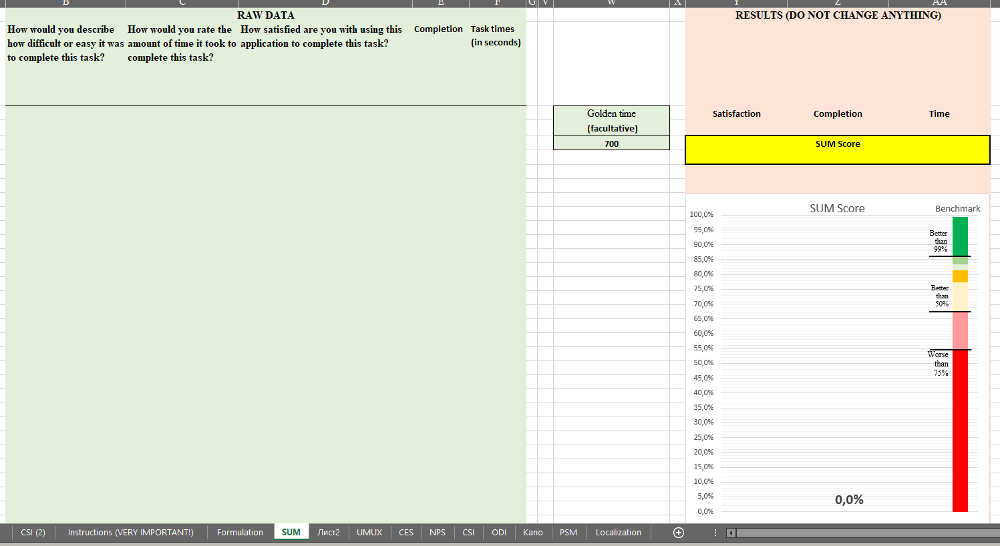
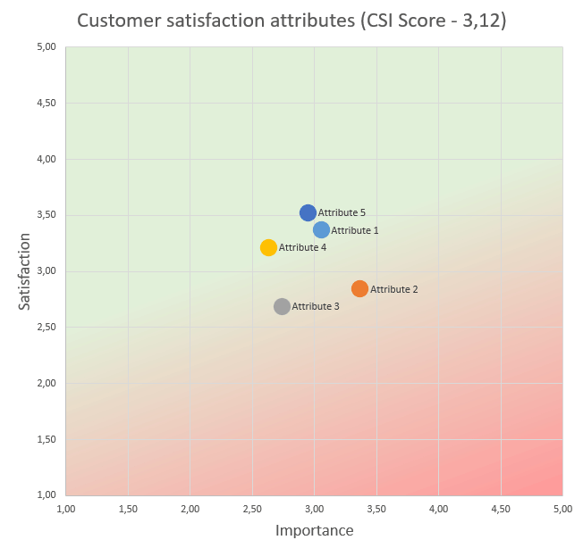
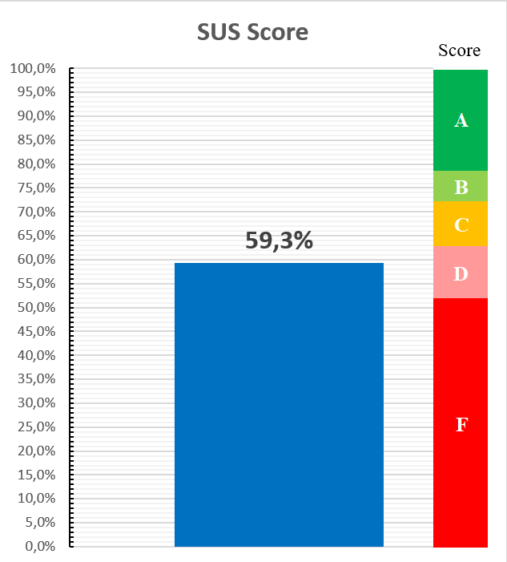

Швейцарский исслежовательский эксельбук — это универсальный инструмент для UX-исследователей и аналитиков, предоставляющий готовую Excel-таблицу с предустановленными формулами и визуализациями. Этот инструмент позволяет быстро рассчитывать ключевые UX-метрики, анализировать результаты исследований и визуализировать данные без необходимости использования сложных программ или скриптов.

## Зачем он нужен?
* Экономия времени. Вам не нужно настраивать формулы или создавать диаграммы вручную. Всё уже подготовлено, чтобы вы могли сосредоточиться на анализе.
* Доступность. Используется только Excel, без макросов, не нужно устанавливать дополнительные инструменты или бодаться с вашей службой безопасности.
* Гибкость. Вы можете адаптировать таблицу под свои исследования и задачи.
Универсальность. Подходит для работы с данными опросов, тестирования юзабилити и других UX-методов.

## Возможности

### Легкий расчет метрик

Просто вставьте подготовленные данные в таблицу (ориентируясь на инструкцию), дальше она сама все посчитает

## Куча различных метрик

What calculators are already available

* **SUM (Single Usability Metric)** - единая метрика для измерения юзабилити

* **UMUX (Usability Metric for User Experience)** - опросник для измерения юзабилити продукта

* **CES (Customer Effort Score)** - оценка сложности конкретного действия

* **NPS (Net Promoter Score)** - индекс потребительской лояльности

* **CSI (Customer Satisfaction Score)** - индекс удовлетворенности продуктом

* **ODI (Outcome Driven Innovation)** - определение значимости job statement в рамках JTBD и подхода outcome driven innovation (подход Ульвика)

* **Kano model** - модель для оценки влияния определенных аттриубтов (фич) продукта на удовлетворенность этим продуктом

* **PSM (Price Sensitivity Meter)** - четыре вопроса для выявления оптимальной цены продукта

## Графики для каждой метрики

Для каждой метрики генерируются графики, чтобы можно было их красиво вставить в презентацию с результатами

## Бенчмарки

Там где возможно, для метрик на графике размечены бенчмарки для упрощения анализа

#### Как оно работает?

- Скачиваете табличку
- Выбираете вкладку с нужной метрикой
- Вставляете чищенные данные туда по готовому шаблону 

В файле есть подробная инструкция по использованию, пример кодов данных и немножко заметок по работе с каждой метрикой 

Скачать Швейцарский Исследовательский Эксельбук можно [здесь](https://github.com/UXRozum/Swiss_Excelbook)!